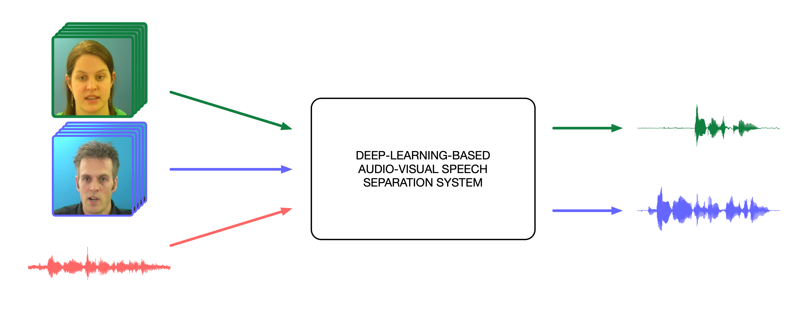

# Deep-Learning-Based Audio-Visual Speech Enhancement and Separation

This document provides a list of resources on audio-visual speech enhancement and separation based on deep learning. It can be seen as an appendix to [our overview paper on the topic](https://arxiv.org/abs/2008.09586).

Our intention is to update the list, when new material on the topic is released. The symbol '*' will be used beside a resource to indicate that it was not cited in our overview article. Feel free to propose changes or point out a resource that should be included.

If you like and use this work, please :star: and consider citing our overview article. This will highlight the interest of the community in our work.

    @article{michelsanti2021overview,
	Author = {Michelsanti, Daniel and Tan, Zheng-Hua and Zhang, Shi-Xiong and Xu, Yong and Yu, Meng and Yu, Dong and Jensen, Jesper},
	Title = {An Overview of Deep-Learning-Based Audio-Visual Speech Enhancement and Separation},
	journal={IEEE/ACM Transactions on Audio, Speech, and Language Processing},
	volume={29},
	pages={1368-1396},
	doi={10.1109/TASLP.2021.3066303}
	Year = {2021}}

## Table of Contents  
- [Audio-Visual Speech Corpora](#audio-visual-speech-corpora)
- [Performance Assessment](#performance-assessment)
- [Audio-Visual Speech Enhancement and Separation](#audio-visual-speech-enhancement-and-separation)
- [Speech Reconstruction from Silent Videos](#speech-reconstruction-from-silent-videos)
- [Audio-Visual Sound Source Separation for Non-Speech Signals](#audio-visual-sound-source-separation-for-non-speech-signals)
- [Related Overview Articles](#related-overview-articles)

## Audio-Visual Speech Corpora

* AVA-ActiveSpeaker [[paper]](https://arxiv.org/pdf/1901.01342.pdf) [[dataset page]](https://research.google.com/ava/index.html)

* AV Chinese Mandarin [[paper]](https://arxiv.org/pdf/1909.07352.pdf)

* AVSpeech [[paper]](https://arxiv.org/pdf/1804.03619.pdf) [[dataset page]](https://looking-to-listen.github.io/avspeech/index.html)

* ASPIRE [[paper]](https://arxiv.org/pdf/1909.10407.pdf) [[dataset page]](https://cochleanet.github.io)

* CREMA-D [[paper]](https://www.ncbi.nlm.nih.gov/pmc/articles/PMC4313618/) [[dataset page]](https://github.com/CheyneyComputerScience/CREMA-D) *

* CUAVE [[paper]](http://citeseerx.ist.psu.edu/viewdoc/download?doi=10.1.1.91.6375&rep=rep1&type=pdf)

* EasyCom [[paper]](https://arxiv.org/pdf/2107.04174.pdf) [[dataset page]](https://github.com/facebookresearch/EasyComDataset) *

* Facestar [[paper]](https://arxiv.org/pdf/2203.17263.pdf) [[dataset page]](https://github.com/facebookresearch/facestar) *

* GRID [[paper]](http://www.laslab.org/wp-content/uploads/an_audio-visual_corpus_for_speech_perception_and_automatic_speech_recognition.pdf) [[dataset page]](http://spandh.dcs.shef.ac.uk/gridcorpus/)

* KinectDigits [[paper]](https://www.honda-ri.de/pubs/pdf/3275.pdf) [[dataset page]](https://zenodo.org/record/823531#.Xzml9y17HOQ)

* LDC2009V01 [[dataset page]](https://catalog.ldc.upenn.edu/LDC2009V01)

* Lombard GRID [[paper]](https://staffwww.dcs.shef.ac.uk/people/G.Brown/pdf/alghamdi_etal_2018_lombard.pdf) [[dataset page]](http://spandh.dcs.shef.ac.uk/avlombard/)

* LRS [[paper]](http://www.robots.ox.ac.uk/~vgg/publications/2017/Chung17/chung17.pdf)

* LRS2 [[paper]](https://www.robots.ox.ac.uk/~vgg/publications/2019/Afouras19/afouras18c.pdf) [[dataset page]](http://www.robots.ox.ac.uk/~vgg/data/lip_reading/lrs2.html)

* LRS3 [[paper]](https://arxiv.org/pdf/1809.00496.pdf) [[dataset page]](http://www.robots.ox.ac.uk/~vgg/data/lip_reading/lrs3.html)

* LRW [[paper]](https://ora.ox.ac.uk/objects/uuid:c3238375-ec8b-4ecd-9543-8b179a6b74ba/download_file?safe_filename=chung16.pdf&file_format=application%2Fpdf&type_of_work=Conference+item) [[dataset page]](http://www.robots.ox.ac.uk/~vgg/data/lip_reading/lrw1.html)

* Mandarin Sentences Corpus [[paper]](https://arxiv.org/pdf/1703.10893)

* MODALITY [[paper]](https://link.springer.com/article/10.1007/s10844-016-0438-z) [[dataset page]](http://modality-corpus.org)

* MV-LRS [[paper]](https://ora.ox.ac.uk/objects/uuid:9f06858c-349c-416f-8ace-87751cd401fc/download_file?safe_filename=chung17a.pdf&file_format=application%2Fpdf&type_of_work=Conference+item)

* NTCD-TIMIT [[paper]](https://www.isca-speech.org/archive/Interspeech_2017/pdfs/0860.PDF) [[dataset page]](https://zenodo.org/record/260228#.XzqK5y17HOQ)

* Obama Weekly Addresses [[paper]](https://arxiv.org/pdf/1711.08789)

* OuluVS [[paper]](http://www.ee.oulu.fi/~gyzhao/Papers/2009/Lipreading%20with%20Local%20Spatiotemporal.pdf) [[dataset page]](https://www.oulu.fi/cmvs/node/41315)

* OuluVS2 [[paper]](https://www.researchgate.net/profile/Ziheng_Zhou/publication/283593688_OuluVS2_A_multi-view_audiovisual_database_for_non-rigid_mouth_motion_analysis/links/5754caf608ae17e65ecccde3.pdf) [[dataset page]](http://www.ee.oulu.fi/research/imag/OuluVS2/)

* RAVDESS [[paper]](https://journals.plos.org/plosone/article/file?id=10.1371/journal.pone.0196391&type=printable) [[dataset page]](https://zenodo.org/record/1188976#.XzskXy17HOQ)

* Small Mandarin Sentences Corpus [[paper]](https://www.citi.sinica.edu.tw/papers/yu.tsao/5427-F.pdf)

* TCD-TIMIT [[paper]](https://ieeexplore.ieee.org/abstract/document/7050271) [[dataset page]](https://sigmedia.tcd.ie/TCDTIMIT/)

* VISION [[paper]](http://www.interspeech2020.org/uploadfile/pdf/Thu-2-11-6.pdf) *

* VoxCeleb [[paper]](https://arxiv.org/pdf/1706.08612) [[dataset page]](http://www.robots.ox.ac.uk/~vgg/data/voxceleb/vox1.html)

* VoxCeleb2 [[paper]](https://arxiv.org/pdf/1806.05622) [[dataset page]](http://www.robots.ox.ac.uk/~vgg/data/voxceleb/vox2.html)

## Performance Assessment

### Estimators of speech quality based on perceptual models 

* CSIG / CBAK / COVRL [[paper]](https://ecs.utdallas.edu/loizou/speech/obj_paper_jan08.pdf)

* HASQI [[paper v1]](https://www.aes.org/e-lib/browse.cfm?elib=15451) [[paper v2]](https://www.aes.org/e-lib/browse.cfm?elib=17126) [[code]](https://www.colorado.edu/lab/hearlab/resources)

* PESQ [[paper]](https://citeseerx.ist.psu.edu/viewdoc/download?doi=10.1.1.5.9136&rep=rep1&type=pdf) [[code]](https://www.itu.int/rec/T-REC-P.862-200511-I!Amd2/en)

* POLQA [[recommendation]](https://www.itu.int/rec/T-REC-P.863-201803-I/en) [[code]](http://www.polqa.info/products.html)

* ViSQOL [[paper 1]](https://storage.googleapis.com/pub-tools-public-publication-data/pdf/39979.pdf) [[paper 2]](https://asmp-eurasipjournals.springeropen.com/articles/10.1186/s13636-015-0054-9) [[code]](https://github.com/google/visqol)

### Estimators of speech quality based on energy ratios

* SDR / SIR / SAR (BSS Eval) [[paper]](https://www.irisa.fr/metiss/gribonval/Papers/2006/2006_IEEE_TSAP_VincentFevGrib.pdf) [[code]](http://bass-db.gforge.inria.fr/bss_eval/)

* SDI [[paper]](https://uol.de/f/6/dept/mediphysik/ag/sigproc/download/papers/doclo/journal_wiener.pdf)

* SI-SDR [[paper]](https://arxiv.org/pdf/1811.02508.pdf) [[code]](https://github.com/sigsep/bsseval/issues/3#issuecomment-494995846)

### Estimators of speech intelligibility

* CSII [[paper]](https://www.researchgate.net/profile/James_Kates2/publication/7842209_Coherence_and_the_speech_intelligibility_index/links/546f5dab0cf2d67fc0310f88/Coherence-and-the-speech-intelligibility-index.pdf)

* ESII [[paper]](https://pure.uva.nl/ws/files/3886153/45240_205638y.pdf)

* ESTOI [[paper]](https://www.researchgate.net/profile/Cees_Taal/publication/306046797_An_Algorithm_for_Predicting_the_Intelligibility_of_Speech_Masked_by_Modulated_Noise_Maskers/links/5ae0d5ab0f7e9b2859480a5e/An-Algorithm-for-Predicting-the-Intelligibility-of-Speech-Masked-by-Modulated-Noise-Maskers.pdf) [[code]](http://kom.aau.dk/~jje/code/estoi.m)

* HASPI [[paper]](https://www.sciencedirect.com/science/article/abs/pii/S0167639314000545) [[code]](https://www.colorado.edu/lab/hearlab/resources)

* SII [[paper]](https://global.ihs.com/doc_detail.cfm?document_name=ANSI%2FASA%20S3%2E5&item_s_key=00009562&csf=ASA) [[code]](http://sii.to/programs.html)

* STOI [[paper]](http://cas.et.tudelft.nl/pubs/Taal2011_1.pdf) [[code]](http://ceestaal.nl/stoi_mp.zip)

## Audio-Visual Speech Enhancement and Separation

* A. Adeel, J. Ahmad, H. Larijani, and A. Hussain, “A novel real-time, lightweight chaotic-encryption scheme for next-generation audio-visual hearing aids,” Cognitive Computation, vol. 12, no. 3, pp. 589–601, 2019. [[paper]](https://link.springer.com/article/10.1007%2Fs12559-019-09653-z)

* A. Adeel, M. Gogate, and A. Hussain, “Towards next-generation lip-reading driven hearing-aids: A preliminary prototype demo,” in Proc. of CHAT, 2017. [[paper]](http://spandh.dcs.shef.ac.uk/chat2017/papers/CHAT_2017_adeel.pdf) [[demo]](https://cogbid.github.io/cogavhearingdemo/)

* A. Adeel, M. Gogate, and A. Hussain, “Contextual deep learning-based audio-visual switching for speech enhancement in real-world environments,” Information Fusion, vol. 59, pp. 163–170, 2020. [[paper]](https://www.sciencedirect.com/science/article/abs/pii/S1566253518306018)

* A. Adeel, M. Gogate, A. Hussain, and W. M. Whitmer, “Lip-reading driven deep learning approach for speech enhancement,” IEEE Transactions on Emerging Topics in Computational Intelligence, 2019. [[paper]](https://arxiv.org/pdf/1808.00046.pdf)

* T. Afouras, J. S. Chung, and A. Zisserman, “The conversation: Deep audio-visual speech enhancement,” Proc. of Interspeech, 2018. [[paper]](https://arxiv.org/pdf/1804.04121) [[project page]](http://www.robots.ox.ac.uk/~vgg/demo/theconversation/) [[demo 1]](https://www.youtube.com/watch?v=2TWotLwutkI&feature=youtu.be) [[other demos]](http://www.robots.ox.ac.uk/~vgg/demo/theconversation/)

* T. Afouras, J. S. Chung, and A. Zisserman, “My lips are concealed: Audio-visual speech enhancement through obstructions,” in Proc. of Interspeech, 2019. [[paper]](https://arxiv.org/pdf/1907.04975) [[project page]](http://www.robots.ox.ac.uk/~vgg/research/concealed) [[demo]](http://www.robots.ox.ac.uk/~vgg/research/concealed/)

* Z. Aldeneh, A. P. Kumar, B.-J. Theobald, E. Marchi, S. Kajarekar, D. Naik, and A. H. Abdelaziz, “Self-supervised learning of visual speech features with audiovisual speech enhancement,” arXiv preprint arXiv:2004.12031, 2020. [[paper]](https://arxiv.org/pdf/2004.12031)

* A. Arriandiaga, G. Morrone, L. Pasa, L. Badino, and C. Bartolozzi, “Audio-visual target speaker extraction on multi-talker environment using event-driven cameras,” arXiv preprint arXiv:1912.02671, 2019. [[paper]](https://arxiv.org/pdf/1912.02671.pdf)

* S.-Y. Chuang, Y. Tsao, C.-C. Lo, and H.-M. Wang, “Lite audio-visual speech enhancement,” in Proc. of Interspeech (to appear), 2020. [[paper]](https://arxiv.org/pdf/2005.11769) [[code]](https://github.com/kagaminccino/LAVSE)

* H. Chen, J. Du, Y. Hu, L.-R. Dai, B.-C. Yin, C.-H. Lee, “Correlating subword articulation with lip shapes for embedding aware audio-visual speech enhancement
,” in Neural Network, vol. 143, pp. 171-182, 2021. [[paper]](https://arxiv.org/pdf/2009.09561.pdf) *

* S.-W. Chung, S. Choe, J. S. Chung, and H.-G. Kang, “Facefilter:
Audio-visual speech separation using still images,” arXiv preprint
arXiv:2005.07074, 2020. [[paper]](https://arxiv.org/pdf/2005.07074.pdf) [[demo]](https://youtu.be/ku9xoLh62E4)

* A. Ephrat, I. Mosseri, O. Lang, T. Dekel, K. Wilson, A. Hassidim, W. T. Freeman, and M. Rubinstein, “Looking to listen at the cocktail party: A speaker-independent audio-visual model for speech separation,” ACM Transactions on Graphics, vol. 37, no. 4, pp. 112:1–112:11, 2018. [[paper]](https://arxiv.org/pdf/1804.03619.pdf) [[project page]](https://looking-to-listen.github.io) [[demo]](https://www.youtube.com/watch?v=rVQVAPiJWKU&feature=emb_title) [[supplementary material]](https://looking-to-listen.github.io/supplemental/index.html)

* A. Gabbay, A. Ephrat, T. Halperin, and S. Peleg, “Seeing through noise: Visually driven speaker separation and enhancement,” in Proc. of ICASSP, 2018. [[paper]](https://arxiv.org/pdf/1708.06767.pdf) [[project page]](http://www.vision.huji.ac.il/speaker-separation/) [[demo]](https://www.youtube.com/watch?v=qmsyj7vAzoI&feature=emb_title) [[code]](https://github.com/avivga/cocktail-party)

* A. Gabbay, A. Shamir, and S. Peleg, “Visual speech enhancement,” in Proc. of Interspeech, 2018. [[paper]](https://arxiv.org/pdf/1711.08789.pdf) [[project page]](http://www.vision.huji.ac.il/visual-speech-enhancement/) [[demo 1]](https://www.youtube.com/watch?v=nyYarDGpcYA&feature=emb_title) [[other demos]](http://www.vision.huji.ac.il/visual-speech-enhancement/) [[code]](https://github.com/avivga/audio-visual-speech-enhancement)

* R. Gao and K. Grauman, “VISUALVOICE: Audio-visual speech separation with cross-modal consistency,” in Proc. of CVPR, 2021. [[paper]](https://arxiv.org/pdf/2101.03149.pdf) [[project page]](http://vision.cs.utexas.edu/projects/VisualVoice/) [[demo]](https://www.youtube.com/watch?v=tNR9QD6IN8c) [[code]](https://github.com/facebookresearch/VisualVoice) [[supplementary material]](http://vision.cs.utexas.edu/projects/VisualVoice/VisualVoice_Supp.pdf) *

* M. Gogate, A. Adeel, R. Marxer, J. Barker, and A. Hussain, “DNN
driven speaker independent audio-visual mask estimation for speech
separation,” in Proc. of Interspeech, 2018. [[paper]](https://arxiv.org/pdf/1808.00060.pdf)

* M. Gogate, K. Dashtipour, A. Adeel, and A. Hussain, “Cochleanet: A robust language-independent audio-visual model for speech enhancement,” Information Fusion, vol. 63, pp. 273–285, 2020. [[paper]](https://arxiv.org/pdf/1909.10407.pdf) [[project page]](https://cochleanet.github.io) [[demo]](https://vimeo.com/357546330) [[supplementary material]](https://cochleanet.github.io/supplementary/)

* M. Gogate, K. Dashtipour, and A. Hussain, “Towards Robust Real-time Audio-Visual Speech Enhancement,” arXiv preprint arXiv:2112.09060, 2021. [[paper]](https://arxiv.org/pdf/2112.09060.pdf) *

* R. Gu, S.-X. Zhang, Y. Xu, L. Chen, Y. Zou, and D. Yu, “Multi-modal multi-channel target speech separation,” IEEE Journal of Selected Topics in Signal Processing, 2020. [[paper]](https://arxiv.org/pdf/2003.07032.pdf) [[project page]](https://moplast.github.io) [[demo]](https://moplast.github.io)

* J.-C. Hou, S.-S. Wang, Y.-H. Lai, Y. Tsao, H.-W. Chang, and H.- M. Wang, “Audio-visual speech enhancement using multimodal deep convolutional neural networks,” IEEE Transactions on Emerging Topics in Computational Intelligence, vol. 2, no. 2, pp. 117–128, 2018. [[paper]](https://arxiv.org/pdf/1703.10893.pdf)

* J.-C. Hou, S.-S. Wang, Y.-H. Lai, J.-C. Lin, Y. Tsao, H.-W. Chang, and H.-M. Wang, “Audio-visual speech enhancement using deep neural networks,” in Proc. of APSIPA, 2016. [[paper]](https://www.citi.sinica.edu.tw/papers/yu.tsao/5427-F.pdf)

* A. Hussain, J. Barker, R. Marxer, A. Adeel, W. Whitmer, R. Watt, and P. Derleth, “Towards multi-modal hearing aid design and evaluation in realistic audio-visual settings: Challenges and opportunities,” in Proc. of CHAT, 2017. [[paper]](http://spandh.dcs.shef.ac.uk/chat2017/papers/CHAT_2017_hussain.pdf) 

* T. Hussain, M. Gogate, K. Dashtipour, and A. Hussain, “Towards intelligibility-oriented audio-visual speech enhancement,” arXiv preprint arXiv:2111.09642, 2021. [[paper]](https://arxiv.org/pdf/2111.09642.pdf) *

* E. Ideli, “Audio-visual speech processing using deep learning techniques.” MSc thesis, Applied Sciences: School of Engineering Science, 2019. [[paper]](https://summit.sfu.ca/item/19744)

* E. Ideli, B. Sharpe, I. V. Bajić, and R. G. Vaughan,“Visually assisted time-domain speech enhancement,” in Proc. of GlobalSIP, 2019. [[paper]](https://ieeexplore.ieee.org/abstract/document/8969244)

* B. İnan, M. Cernak, H. Grabner, H. P. Tukuljac, R. C. Pena, and
B. Ricaud, “Evaluating audiovisual source separation in the context of video conferencing,” Proc. of Interspeech, 2019. [[paper]](https://www.isca-speech.org/archive/Interspeech_2019/pdfs/2671.pdf) [[code]](https://github.com/berkayinan/audiovisual-separation-for-vc)

* K. Ito, M. Yamamoto, and K. Nagamatsu, “Audio-visual speech enhancement method conditioned in the lip motion and speaker-discriminative embeddings,” Proc. of ICASSP, 2021. [[paper]](https://ieeexplore.ieee.org/document/9414133) *

* M. L. Iuzzolino and K. Koishida, “AV(SE)²: Audio-visual squeeze- excite speech enhancement,” in Proc. of ICASSP. IEEE, 2020, pp. 7539–7543. [[paper]](https://ieeexplore.ieee.org/abstract/document/9054528)

* H. R. V. Joze, A. Shaban, M. L. Iuzzolino, and K. Koishida, “MMTM: Multimodal transfer module for CNN fusion,” Proc. of CVPR, 2020. [[paper]](https://openaccess.thecvf.com/content_CVPR_2020/papers/Joze_MMTM_Multimodal_Transfer_Module_for_CNN_Fusion_CVPR_2020_paper.pdf)

* F. U. Khan, B. P. Milner, and T. Le Cornu, “Using visual speech information in masking methods for audio speaker separation,” IEEE/ACM Transactions on Audio, Speech, and Language Processing, vol. 26, no. 10, pp. 1742–1754, 2018. [[paper]](https://ueaeprints.uea.ac.uk/id/eprint/67404/1/ieee_speaker_separation_2015_v4.0.pdf) 

* C. Li and Y. Qian, “Deep audio-visual speech separation with attention mechanism,” in Proc. of ICASSP, 2020. [[paper]](https://ieeexplore.ieee.org/abstract/document/9054180)

* Y. Li, Z. Liu, Y. Na, Z. Wang, B. Tian, and Q. Fu, “A visual-pilot deep fusion for target speech separation in multitalker noisy environment,” in Proc. of ICASSP, 2020. [[paper]](https://ieeexplore.ieee.org/abstract/document/9054263)

* R. Lu, Z. Duan, and C. Zhang, “Listen and look: Audio–visual matching assisted speech source separation,” IEEE Signal Processing Letters, vol. 25, no. 9, pp. 1315–1319, 2018. [[paper]](http://www2.ece.rochester.edu/projects/air/publications/lu2018listen.pdf)

* R. Lu, Z. Duan, and C. Zhang, “Audio–visual deep clustering for speech separation, ”IEEE/ACM Transactions on Audio, Speech, and Language Processing, vol. 27, no. 11, pp. 1697–1712, 2019. [[paper]](https://ieeexplore.ieee.org/abstract/document/8762221)

* Y. Luo, J. Wang, X. Wang, L. Wen, and L. Wang, “Audio-visual speech separation using i-Vectors,” in Proc. of ICICSP, 2019. [[paper]](https://ieeexplore.ieee.org/abstract/document/8958547)

* N. Makishima, M. Ihori, A. Takashima, T. Tanaka, S. Orihashi, and R. Masumura, “Audio-visual speech separation using cross-modal correspondence loss,” in Proc. of ICASSP, 2021. [[paper]](https://arxiv.org/pdf/2103.01463.pdf) *

* D. Michelsanti, Z.-H. Tan, S. Sigurdsson, and J. Jensen, “On training targets and objective functions for deep-learning-based audio-visual speech enhancement,” in Proc. of ICASSP, 2019. [[paper]](https://arxiv.org/pdf/1811.06234.pdf) [[supplementary material]](http://kom.aau.dk/~zt/online/icassp2019_sup_mat.pdf)

* D. Michelsanti, Z.-H. Tan, S. Sigurdsson, and J. Jensen, “Deep- learning-based audio-visual speech enhancement in presence of Lombard effect,” Speech Communication, vol. 115, pp. 38–50, 2019. [[paper]](https://arxiv.org/pdf/1905.12605.pdf) [[demo]](https://www.youtube.com/watch?v=IRlaU0EMeOg)

* D. Michelsanti, Z.-H. Tan, S. Sigurdsson, and J. Jensen, “Effects of Lombard reflex on the performance of deep-learning-based audio-visual speech enhancement systems,” in Proc. of ICASSP, 2019. [[paper]](https://arxiv.org/pdf/1811.06250.pdf) [[demo]](https://vbn.aau.dk/en/activities/demo-effects-of-lombard-reflex-on-deep-learning-based-audio-visua)

* J. F. Montesinos, V. S. Kadandale, and G. Haro, “VoViT: Low Latency Graph-based Audio-Visual Voice Separation Transformer,” arXiv preprint arXiv:2203.04099, 2022. [[paper]](https://arxiv.org/pdf/2203.04099.pdf) [[demo]](https://ipcv.github.io/VoViT/demos/) [[code]](https://github.com/JuanFMontesinos/VoViT) [[project page]](https://ipcv.github.io/VoViT/) *

* G. Morrone, S. Bergamaschi, L. Pasa, L. Fadiga, V. Tikhanoff, and L. Badino, “Face landmark-based speaker-independent audio-visual speech enhancement in multi-talker environments,” in Proc. of ICASSP, 2019. [[paper]](https://arxiv.org/pdf/1811.02480.pdf) [[project page]](https://dr-pato.github.io/audio_visual_speech_enhancement/) [[demo]](https://www.youtube.com/watch?v=YQ0q-OFphKM&feature=emb_title) [[other demos]](https://dr-pato.github.io/audio_visual_speech_enhancement/) [[code]](https://github.com/dr-pato/audio_visual_speech_enhancement)

* T. Ochiai, M. Delcroix, K. Kinoshita, A. Ogawa, and T. Nakatani, “Multimodal SpeakerBeam: Single channel target speech extraction with audio-visual speaker clues,” Proc. Interspeech, 2019. [[paper]](https://www.isca-speech.org/archive/Interspeech_2019/pdfs/1513.pdf)

* A. Owens and A. A. Efros, “Audio-visual scene analysis with self-supervised multisensory features,” in Proc. of ECCV, 2018. [[paper]](https://arxiv.org/pdf/1804.03641.pdf) [[project page]](http://andrewowens.com/multisensory) [[demo]](https://www.youtube.com/watch?v=rwCIRu_hAJ8&feature=emb_title) [[code]](https://github.com/andrewowens/multisensory)

* Z. Pan, M. Ge and H. Li, “USEV: Universal speaker extraction with visual cue,” 2021. [[paper]](https://arxiv.org/pdf/2109.14831.pdf) [[code]](https://github.com/zexupan/USEV) *

* Z. Pan, R. Tao, C. Xu and H. Li, “MuSe: Multi-modal target speaker extraction with visual cues,” in Proc. of ICASSP, 2021. [[paper]](https://arxiv.org/pdf/2010.07775.pdf) [[code]](https://github.com/zexupan/MuSE) *

* Z. Pan, R. Tao, C. Xu and H. Li, “Selective Hearing through Lip-reading,” arXiv preprint arXiv:2106.07150, 2021. [[paper]](https://arxiv.org/pdf/2106.07150.pdf) [[code]](https://github.com/zexupan/reentry) *

* L. Pasa, G. Morrone, and L. Badino, “An analysis of speech enhancement and recognition losses in limited resources multi-talker single channel audio-visual ASR,” in Proc. of ICASSP, 2020. [[paper]](https://arxiv.org/pdf/1904.08248.pdf)

* L. Qu, C. Weber, and S. Wermter, “Multimodal target speech separation with voice and face references,” arXiv preprint arXiv:2005.08335, 2020. [[paper]](https://arxiv.org/pdf/2005.08335.pdf) [[project page]](leyuanqu.github.io/INTERSPEECH2020) [[demo]](leyuanqu.github.io/INTERSPEECH2020)

* M. Sadeghi and X. Alameda-Pineda, “Mixture of inference networks for VAE-based audio-visual speech enhancement,” arXiv preprint arXiv:1912.10647, 2019. [[paper]](https://arxiv.org/pdf/1912.10647.pdf) [[project page]](https://team.inria.fr/perception/research/min-vae-se/) [[demo]](https://team.inria.fr/perception/research/min-vae-se/#audio) [[code]](https://gitlab.inria.fr/smostafa/avse-vae)

* M. Sadeghi and X. Alameda-Pineda, “Robust unsupervised audio-visual speech enhancement using a mixture of variational autoencoders,” in Proc. of ICASSP, 2020. [[paper]](https://arxiv.org/pdf/1911.03930.pdf) [[project page]](https://team.inria.fr/perception/research/vae-mm-se/) [[supplementary material]](https://team.inria.fr/perception/files/2019/10/vae_mm_supp.pdf) [[code]](https://gitlab.inria.fr/smostafa/avse-vae)

* M. Sadeghi and X. Alameda-Pineda, “Switching variational auto-encoders for noise-agnostic audio-visual speech enhancement,” in Proc. of ICASSP, 2021. [[paper]](https://arxiv.org/pdf/2102.04144.pdf) [[project page]](https://team.inria.fr/perception/research/swvae/) *

* M. Sadeghi, S. Leglaive, X. Alameda-Pineda, L. Girin, and R. Horaud, “Audio-visual speech enhancement using conditional variational autoencoders,” IEEE/ACM Transactions on Audio, Speech, and Language Processing, vol. 28, pp. 1788–1800, 2020. [[paper]](https://arxiv.org/pdf/1908.02590.pdf) [[project page]](https://team.inria.fr/perception/research/av-vae-se/) [[demo]](https://team.inria.fr/perception/research/av-vae-se/) [[code]](https://gitlab.inria.fr/smostafa/avse-vae)

* H. Sato, T. Ochiai, K. Kinoshita, M. Delcroix, T. Nakatani and S. Araki. “Multimodal attention fusion for target speaker extraction,” in Proc. of SLT, 2021. [[paper]](https://arxiv.org/pdf/2102.01326.pdf) [[project page]](http://www.kecl.ntt.co.jp/icl/signal/member/demo/audio_visual_speakerbeam.html) [[demo]](http://www.kecl.ntt.co.jp/icl/signal/member/demo/audio_visual_speakerbeam.html) *

* S. S. Shetu, S. Chakrabarty, and E. A. P. Habets, “An empirical study of visual features for DNN based audio-visual speech enhancement in multi-talker environments,” in Proc. of ICASSP, 2021. [[paper]](https://arxiv.org/pdf/2011.04359.pdf) *

* Z. Sun, Y. Wang, and L. Cao, “An attention based speaker-independent audio-visual deep learning model for speech enhancement,” in Proc. of MMM, 2020. [[paper]](https://link.springer.com/chapter/10.1007/978-3-030-37734-2_60)

* K. Tan, Y. Xu, S.-X. Zhang, M. Yu, and D. Yu, “Audio-visual speech separation and dereverberation with a two-stage multimodal network,” IEEE Journal of Selected Topics in Signal Processing, vol. 14, no. 3, pp. 542–553, 2020. [[paper]](https://arxiv.org/pdf/1909.07352.pdf) [[project page]](https://jupiterethan.github.io/av-enh.github.io/) [[demo]](https://jupiterethan.github.io/av-enh.github.io/)

* W. Wang, C. Xing, D. Wang, X. Chen, and F. Sun, “A robust audio-visual speech enhancement model,” in Proc. of ICASSP, 2020. [[paper]](https://ieeexplore.ieee.org/abstract/document/9053033)

* J. Wu, Y. Xu, S.-X. Zhang, L.-W. Chen, M. Yu, L. Xie, and D. Yu, “Time domain audio visual speech separation,” in Proc. of ASRU, 2019. [[paper]](https://arxiv.org/pdf/1904.03760.pdf) [[project page]](https://funcwj.github.io/online-demo/page/tavs) [[demo]](https://funcwj.github.io/online-demo/page/tavs)

* Z. Wu, S. Sivadas, Y. K. Tan, M. Bin, and R. S. M. Goh,“Multi-modal hybrid deep neural network for speech enhancement,” arXiv preprint arXiv:1606.04750, 2016. [[paper]](https://arxiv.org/pdf/1606.04750.pdf) 

* X. Xu, Y. Wang, D. Xu, C. Zhang, Y. Peng, J. Jia, and B. Chen, “VSEGAN: Visual speech enhancement generative adversarial network,” arXiv preprint arXiv:2102.02599, 2021. [[paper]](https://arxiv.org/pdf/2102.02599.pdf) [[project page]](https://xinmengxu.github.io/AVSE/VSEGAN) * 

* X. Xu, Y. Wang, D. Xu, C. Zhang, Y. Peng, J. Jia, and B. Chen, “AMFFCN: Attentional multi-layer feature fusion convolution network for audio-visual speech enhancement,” arXiv preprint arXiv:2101.06268, 2021. [[paper]](https://arxiv.org/pdf/2101.06268.pdf) [[project page]](https://xinmengxu.github.io/AVSE/AMFFCN) *

* Y. Xu, M. Yu, S.-X. Zhang, L. Chen, C. Weng, J. Liu, and D. Yu, “Neural spatio-temporal beamformer for target speech separation,” Proc. of Interspeech (to appear), 2020. [[paper]](https://arxiv.org/pdf/2005.03889.pdf) [[project page]](https://yongxuustc.github.io/mtmvdr) [[demo]](https://yongxuustc.github.io/mtmvdr)

* K. Yang, D. Markovic, S. Krenn, V. Agrawal, and A. Richard, “Audio-visual speech codecs: rethinking audio-visual speech enhancement by re-synthesis,” Proc. of CVPR (to appear), 2022. [[paper]](https://arxiv.org/pdf/2203.17263.pdf) *

## Speech Reconstruction From Silent Videos

* H. Akbari, H. Arora, L. Cao, and N. Mesgarani, “Lip2AudSpec: Speech reconstruction from silent lip movements video,” in Proc. of ICASSP, 2018. [[paper]](https://arxiv.org/pdf/1710.09798.pdf) [[demo 1]](https://www.youtube.com/watch?v=Op7Z9KH5Fis&feature=youtu.be) [[demo 2]](https://www.youtube.com/watch?v=O0Gfb-1lu2k&feature=youtu.be) [[demo 3]](https://github.com/hassanhub/LipReading/tree/master/demo) [[code]](https://github.com/hassanhub/LipReading)

* A. Ephrat, T. Halperin, and S. Peleg, “Improved speech reconstruction from silent video,” in Proc. of CVAVM, 2017. [[paper]](https://arxiv.org/pdf/1708.01204.pdf) [[project page]](http://www.vision.huji.ac.il/vid2speech) [[demo]](https://www.youtube.com/watch?v=Xjbn7h7tpg0&feature=emb_title) 

* A. Ephrat and S. Peleg, “Vid2Speech: Speech reconstruction from silent video,” in Proc. of ICASSP, 2017. [[paper]](https://arxiv.org/pdf/1701.00495.pdf) [[project page]](http://www.vision.huji.ac.il/vid2speech/) [[demo 1]](https://www.youtube.com/watch?v=6B0pitNsRSs&feature=emb_title) [[demo 2]](https://www.youtube.com/watch?v=_gG2sewE-IQ&feature=emb_title) [[demo 3]](https://www.youtube.com/watch?v=1FJnv5bf9Mc&feature=emb_title) [[code]](https://github.com/arielephrat/vid2speech)

* J. Hong, M. Kim, S.J. Park, Y.M. Ro, “Speech reconstruction with reminiscent sound via visual voice memory,” in IEEE/ACM Transactions on Audio, Speech, and Language Processing, vol. 29, pp. 3654-3667, 2021. [[paper]](https://ieeexplore.ieee.org/abstract/document/9618777) [[demo]](https://github.com/joannahong/Speech-Reconstruction-with-Reminiscent-Sound-via-Visual-Voice-Memory) *

* M. Kim, J. Hong, Y. M. Ro, “Lip to speech synthesis with visual context attentional GAN,” in Proc. of NeurIPS, 2021. [[paper]](https://arxiv.org/pdf/2011.07340.pdf) *

* Y. Kumar, M. Aggarwal, P. Nawal, S. Satoh, R. R. Shah, and R. Zimmermann, “Harnessing AI for speech reconstruction using multi-view silent video feed,” in Proc. of ACM-MM, 2018. [[paper]](https://arxiv.org/pdf/1807.00619.pdf)

* Y. Kumar, R. Jain, K. M. Salik, R. R. Shah, Y. Yin, and R. Zimmermann, “Lipper: Synthesizing thy speech using multi-view lipreading,” in Proc. of AAAI, 2019. [[paper]](https://arxiv.org/pdf/1907.01367.pdf) [[demo]](https://www.youtube.com/playlist?list=PL9rvax0EIUA4LNaXSeVX5Kt6gu2IBBnsg)

* Y. Kumar, R. Jain, M. Salik, R. R. Shah, R. Zimmermann, and Y. Yin, “MyLipper: A personalized system for speech reconstruction using multi-view visual feeds,” in Proc. of ISM, 2018. [[paper]](https://ieeexplore.ieee.org/document/8603277) [[demo]](https://www.youtube.com/watch?v=aIT0NYbQ0Go&feature=youtu.be)

* T. Le Cornu and B. Milner, “Reconstructing intelligible audio speech from visual speech features,” in Proc. of Interspeech, 2015. [[paper]](https://www.isca-speech.org/archive/interspeech_2015/papers/i15_3355.pdf)

* T. Le Cornu and B. Milner, “Generating intelligible audio speech from visual speech,” IEEE/ACM Transactions on Audio, Speech, and Language Processing, vol. 25, no. 9, pp. 1751–1761, 2017. [[paper]](https://ueaeprints.uea.ac.uk/id/eprint/64052/1/Accepted_manuscript.pdf) [[demo]](https://www.uea.ac.uk/computing/speech-language-and-audio-processing/v2a-results)

* D. Michelsanti, O. Slizovskaia, G. Haro, E. Go ́mez, Z.-H. Tan, and J. Jensen, “Vocoder-based speech synthesis from silent videos,” in Proc. of Interspeech (to appear), 2020. [[paper]](https://arxiv.org/pdf/2004.02541.pdf) [[project page]](https://danmic.github.io/vid2voc/) [[demo]](https://www.youtube.com/watch?v=dBhBCH-agc4&feature=emb_title)

* R. Mira, A. Haliassos, S. Petridis, B. W. Schuller, and M. Pantic “SVTS: Scalable Video-to-Speech Synthesis,”  arXiv preprint arXiv:2205.02058, 2022. [[paper]](https://arxiv.org/pdf/2205.02058.pdf) [[demo]](https://sites.google.com/view/scalable-vts) *

* R. Mira, K. Vougioukas, P. Ma, S. Petridis, B. W. Schuller, and M. Pantic, “End-to-end video-to-speech synthesis using generative adversarial networks,” arXiv preprint arXiv:2104.13332, 2021. [[paper]](https://arxiv.org/pdf/2104.13332.pdf) [[project page]](https://sites.google.com/view/video-to-speech/home) *

* K. Prajwal, R. Mukhopadhyay, V. P. Namboodiri, and C. Jawahar, “Learning individual speaking styles for accurate lip to speech synthesis,” in Proc. of CVPR, 2020. [[paper]](https://arxiv.org/pdf/2005.08209.pdf) [[project page]](http://cvit.iiit.ac.in/research/projects/cvit-projects/speaking-by-observing-lip-movements) [[demo]](https://www.youtube.com/watch?v=HziA-jmlk_4&feature=youtu.be) [[code]](https://github.com/Rudrabha/Lip2Wav)

* L. Qu, C. Weber, and S. Wermter. "LipSound: Neural Mel-Spectrogram Reconstruction for Lip Reading," in Proc. of Interspeech, 2019. [[paper]](https://www.isca-speech.org/archive/Interspeech_2019/pdfs/1393.pdf) [[demo]](https://soundcloud.com/user-612210805/sets/video-to-mel) *

* N. Saleem, J. Gao, M. Irfan, E. Verdu, and J. Parra Fuente. “E2E-V2SResNet: Deep residual convolutional neural networks for end-to-end video driven speech synthesis,” in Image and Vision Computing, Vol. 119, 2022. [[paper]](https://www.sciencedirect.com/science/article/pii/S026288562200018X) *

* Y. Takashima, T. Takiguchi, and Y. Ariki, “Exemplar-based lip-to-speech synthesis using convolutional neural networks,” in Proc. of IW-FCV, 2019. [[paper]](http://www.me.cs.scitec.kobe-u.ac.jp/~takigu/pdf/2019/O1-4.pdf)

* S. Uttam, Y. Kumar, D. Sahrawat, M. Aggarwal, R. R. Shah, D. Mahata, and A. Stent, “Hush-hush speak: Speech reconstruction using silent videos,” in Proc. of Interspeech, 2019. [[paper]](https://www.isca-speech.org/archive/Interspeech_2019/pdfs/3269.pdf) [[demo]](https://drive.google.com/open?id=1ZWS4L3SaZyb7SNwTaMpY96uJRYfFcVEG) [[code]](https://github.com/midas-research/hush-hush-speak)

* K. Vougioukas, P. Ma, S. Petridis, and M. Pantic, “Video-driven speech reconstruction using generative adversarial networks,” in Proc. of Interspeech, 2019. [[paper]](https://arxiv.org/pdf/1906.06301.pdf) [[project page]](https://sites.google.com/view/speech-synthesis/home) [[demo 1]](https://www.youtube.com/watch?v=W0IPRd-GeCs&feature=emb_title) [[demo 2]](https://www.youtube.com/watch?v=xl1EmVaCP4s&feature=emb_title) [[demo 3]](https://www.youtube.com/watch?v=KJWCo4lbvAI&feature=emb_title)

* D. Wang, S. Yang, D. Su, X. Liu, D. Yu, and H. Meng, “VCVTS: Multi-speaker Video-to-Speech synthesis via cross-modal knowledge transfer from voice conversion,” in arXiv preprint arXiv:2202.09081. [[paper]](https://arxiv.org/pdf/2202.09081.pdf) [[demo]](https://wendison.github.io/VCVTS-demo/) *

* R. Yadav, A. Sardana, V. P. Namboodiri, and R. M. Hegde, “Speech prediction in silent videos using variational autoencoders,” in Proc. of ICASSP, 2021. [[paper]](https://arxiv.org/pdf/2011.07340.pdf) *

## Audio-Visual Sound Source Separation for Non-Speech Signals

* C. Gan, D. Huang, H. Zhao, J. B. Tenenbaum, and A. Torralba, “Music gesture for visual sound separation,” in Proc. of CVPR, 2020. [[paper]](https://arxiv.org/pdf/2004.09476.pdf) [[project page]](http://music-gesture.csail.mit.edu) [[demo]](https://www.youtube.com/watch?v=m6fo2A7qGQM&feature=emb_title)

* R. Gao, R. Feris, and K. Grauman, “Learning to separate object sounds by watching unlabeled video,” in Proc. of ECCV, 2018. [[paper]](https://arxiv.org/pdf/1804.01665.pdf) [[project page]](http://vision.cs.utexas.edu/projects/separating_object_sounds/) [[demo 1]](https://www.youtube.com/watch?v=skeTh2B9rj0&feature=emb_title) [[demo 2]](https://www.youtube.com/watch?v=MlefGnofr4I&feature=emb_title) [[code]](https://github.com/rhgao/Deep-MIML-Network)

* R. Gao and K. Grauman, “2.5D visual sound,” in Proc. of CVPR, 2019. [[paper]](https://arxiv.org/pdf/1812.04204.pdf) [[project page]](http://vision.cs.utexas.edu/projects/2.5D_visual_sound/) [[demo]](https://www.youtube.com/watch?v=Wrx3pv_ixdI&feature=emb_title) [[code]](https://github.com/facebookresearch/2.5D-Visual-Sound)

* R. Gao and K. Grauman, “Co-separating sounds of visual objects,” in Proc. of ICCV, 2019. [[paper]](https://arxiv.org/abs/1904.07750) [[project page]](http://vision.cs.utexas.edu/projects/coseparation/) [[demo]](https://www.youtube.com/watch?v=Tdm5K65WL2I&feature=emb_title) [[code]](https://github.com/rhgao/co-separation)

* S. Parekh, A. Ozerov, S. Essid, N. Q. Duong, P. Pérez, and G. Richard, “Identify, locate and separate: Audio-visual object extraction in large video collections using weak supervision,” in Proc. of WASPAA, 2019. [[paper]](https://arxiv.org/pdf/1811.04000.pdf) [[project page]](https://perso.telecom-paristech.fr/sparekh/icassp2019.html) [[demo]](https://perso.telecom-paristech.fr/sparekh/icassp2019.html)

* J. F. Montesinos, V. S. Kadandale, and G. Haro, “A cappella: Audio-visual Singing Voice Separation,” in Proc. of BMVC, 2021. [[paper]](https://arxiv.org/pdf/2104.09946.pdf) [[project page]](https://ipcv.github.io/Acappella/) [[demo]](https://ipcv.github.io/Acappella/demos/)[[code]](https://github.com/JuanFMontesinos/Acappella-YNet) *

* A. Rouditchenko, H. Zhao, C. Gan, J. McDermott, and A. Torralba, “Self-supervised audio-visual co-segmentation,” in Proc. of ICASSP, 2019. [[paper]](https://arxiv.org/pdf/1904.09013.pdf)

* O. Slizovskaia, G. Haro, and E. Gómez, “Conditioned source separation for music instrument performances,” arXiv preprint arXiv:2004.03873, 2020. [[paper]](https://arxiv.org/pdf/2004.03873.pdf) [[project page]](https://veleslavia.github.io/conditioned-u-net/) [[demo]](https://www.youtube.com/watch?v=qJdsqh2y2C8&feature=emb_title)[[code]](https://github.com/veleslavia/conditioned-u-net)

* X. Xu, B. Dai, and D. Lin, “Recursive visual sound separation using minus-plus net,” in Proc. of ICCV, 2019. [[paper]](https://arxiv.org/pdf/1908.11602.pdf) [[demo]](https://www.youtube.com/watch?v=io_myrxtA4I)

* H. Zhao, C. Gan, W.-C. Ma, and A. Torralba, “The sound of motions,” in Proc. of ICCV, 2019. [[paper]](https://arxiv.org/pdf/1904.05979.pdf) [[demo]](http://people.csail.mit.edu/hangzhao/videos/SoM_supp.mp4)

* H. Zhao, C. Gan, A. Rouditchenko, C. Vondrick, J. McDermott, and A. Torralba, “The sound of pixels,” in Proc. of ECCV, 2018. [[paper]](https://arxiv.org/pdf/1804.03160.pdf) [[project page]](http://sound-of-pixels.csail.mit.edu) [[demo 1]](https://www.youtube.com/watch?v=2eVDLEQlKD0&feature=emb_title) [[demo 2]](http://sound-of-pixels.csail.mit.edu)[[code]](https://github.com/hangzhaomit/Sound-of-Pixels)

* L. Zhu and E. Rahtu, “Separating sounds from a single image,” arXiv preprint arXiv:2007.07984, 2020. [[paper]](https://arxiv.org/pdf/2007.07984.pdf) [[project page]](https://ly-zhu.github.io/separating-sounds-from-single-image)

* L. Zhu and E. Rahtu, “Visually guided sound source separation using cascaded oppo- nent filter network,” arXiv preprint arXiv:2006.03028, 2020. [[paper]](https://arxiv.org/pdf/2006.03028.pdf) [[project page]](https://ly-zhu.github.io/cof-net)

## Related Overview Articles

* J. Rincón-Trujillo and D. M. Córdova-Esparza, “Analysis of speech separation methods based on deep learning,” International Journal of Computer Applications, vol. 148, no. 9, pp. 21–29, 2019. [[paper]](https://pdfs.semanticscholar.org/887e/a4a6101cbd3d76dbd031dd7ed96604c4deb0.pdf)

* B. Rivet, W. Wang, S. M. Naqvi, and J. A. Chambers, “Audiovisual speech source separation: An overview of key methodologies,” IEEE Signal Processing Magazine, vol. 31, no. 3, pp. 125–134, 2014. [[paper]](https://ieeexplore.ieee.org/abstract/document/6784034)

* T. M. F. Taha and A. Hussain, “A survey on techniques for enhancing speech,” International Journal of Computer Applications, vol. 179, no. 17, pp. 1–14, 2018. [[paper]](https://www.researchgate.net/profile/Amir_Hussain5/publication/323223280_A_Survey_on_Techniques_for_Enhancing_Speech/links/5af053e0458515f599848530/A-Survey-on-Techniques-for-Enhancing-Speech.pdf)

* D. L. Wang and J. Chen, “Supervised speech separation based on deep learning: An overview,” IEEE/ACM Transactions on Audio, Speech, and Language Processing, 2018. [[paper]](https://arxiv.org/pdf/1708.07524.pdf)

* H. Zhu, M. Luo, R. Wang, A. Zheng, and R. He, “Deep audio-visual learning: A survey,” arXiv preprint arXiv:2001.04758, 2020. [[paper]](https://arxiv.org/pdf/2001.04758.pdf)

